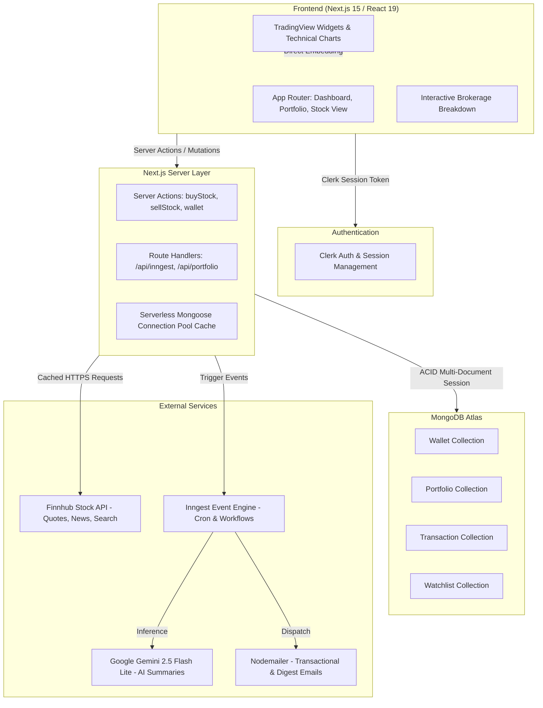

# 🚀 Signalist (Brokerage & Market Intelligence Platform)
## Complete Project Walkthrough & Technical Interview Guide

> **Quick Summary:** Signalist is a full-stack, institutional-grade paper trading and market intelligence platform. It features real-time financial data, interactive TradingView charts, a realistic brokerage fee simulation engine (incorporating STT, Stamp Duty, GST, Exchange charges), ACID-compliant multi-document transactions for portfolio execution, and event-driven AI automations (personalized onboarding and scheduled daily market news summaries via Google Gemini and Inngest).

---

## Table of Contents
1. [Project Overview & Elevator Pitch](#1-project-overview--elevator-pitch)
2. [High-Level Architecture](#2-high-level-architecture)
3. [Core Feature Breakdown](#3-core-feature-breakdown)
4. [Deep-Dive: Technical Highlights & Engineering Decisions](#4-deep-dive-technical-highlights--engineering-decisions)
5. [Database Schema & Data Modeling](#5-database-schema--data-modeling)
6. [Brokerage & Tax Calculation Engine](#6-brokerage--tax-calculation-engine)
7. [Background Jobs & AI Pipeline (Inngest + Gemini)](#7-background-jobs--ai-pipeline-inngest--gemini)
8. [Performance & Resilience Patterns](#8-performance--resilience-patterns)
9. [Tech Stack Matrix](#9-tech-stack-matrix)
10. [Top Interview Questions & Model Answers](#10-top-interview-questions--model-answers)

---

## 1. Project Overview & Elevator Pitch

### 💡 The 60-Second Interview Pitch:
> *"I built Signalist, a full-stack paper trading and financial analytics application designed to simulate real-world equity trading with realistic market dynamics. Built with Next.js 15, React 19, TypeScript, and MongoDB, it provides live market charts using TradingView and Finnhub APIs.*
>
> *Unlike basic demo trading apps that simply increment balances, Signalist implements a realistic transaction fee engine modeling exchange charges, stamp duties, and regulatory taxes. Crucially, trade executions use MongoDB ACID multi-document transactions to guarantee atomic wallet deductions, position averaging, and audit logging.*
>
> *Additionally, I built an event-driven background workflow using Inngest and Google Gemini that delivers AI-curated market digests tailored to the user's specific watchlist and risk profile."*

---

## 2. High-Level Architecture



---

## 3. Core Feature Breakdown

### 1. Market Dashboard & Live Analytics
- **Live TradingView Integration:** Institutional-grade interactive charts, Stock Heatmaps, Top Financial Stories, and Market Screener widgets.
- **Symbol Search & Autocomplete:** Real-time stock search debounced with custom `useDebounce` hook against Finnhub's symbol lookup endpoint.
- **Stock Details View:** Dynamic routing (`/stocks/[symbol]`) featuring candle charts, fundamentals, company profile, and instant trade execution.

### 2. Virtual Trading & Brokerage Engine
- **Initial Cash Allocation:** Every registered user receives a virtual funding wallet with `$100,000.00`.
- **Position Averaging:** Automatically calculates new weighted-average entry prices on consecutive buys:
  $$\text{New Avg Price} = \frac{(\text{Current Qty} \times \text{Current Avg}) + (\text{New Qty} \times \text{New Price})}{\text{Total New Qty}}$$
- **Holdings Liquidation:** Partial and full position sales with real-time realized P&L calculation and automatic position cleanup when balance hits zero.

### 3. Realistic Transaction Charges Model
- Implements real-world market costs instead of idealized zero-cost trades:
  - Flat/Percentage capped Brokerage
  - Exchange Transaction Fees
  - State Stamp Duty (BUY side)
  - Securities Transaction Tax / STT (SELL side)
  - Regulatory SEBI & IPFT Fees
  - 18% GST on brokerage and regulatory services

### 4. Watchlist & Portfolio Management
- Real-time portfolio valuation with batch price hydration via Finnhub.
- Summary metrics: **Cash Balance**, **Current Valuation**, **Total Invested**, and **Unrealized P&L ($ and %)**.
- Single-click watchlist toggling with optimistic UI updates.

### 5. Automated AI Intelligence Pipeline
- **Smart Personalized Onboarding:** Generates tailored investment guidance using Gemini 2.5 based on onboarding profile metadata (risk tolerance, investment goals, preferred industries).
- **Daily Watchlist Digest (Cron Job):** Scheduled daily (`0 12 * * *`) Inngest function that fetches news for each user's specific watchlist symbols, generates a 6-point financial brief using Gemini, and dispatches via Nodemailer.

---

## 4. Deep-Dive: Technical Highlights & Engineering Decisions

### 🌟 Highlight 1: MongoDB Multi-Document ACID Transactions
**File:** [`lib/actions/portfolio.actions.ts`](file:///d:/project/BROKERAGE/lib/actions/portfolio.actions.ts)

**The Problem:** In a financial application, executing a stock purchase involves multiple documents:
1. Deduct cash from `Wallet`.
2. Upsert/Update the holding in `Portfolio`.
3. Create an immutable record in `Transaction`.

If step 2 fails after step 1 succeeds, money disappears without stock being credited (data corruption).

**The Solution:**
```typescript
const session = await mongoose.startSession();
session.startTransaction();
try {
  // 1. Check & deduct wallet balance + fees
  wallet.balance -= totalDeduction;
  await wallet.save({ session });

  // 2. Upsert portfolio position with weighted average price
  await Portfolio.create([holdingData], { session });

  // 3. Record transaction audit log
  await Transaction.create([transactionData], { session });

  // Atomically commit all changes
  await session.commitTransaction();
} catch (error) {
  // Rollback all changes if ANY step fails
  await session.abortTransaction();
  throw error;
} finally {
  session.endSession();
}
```

### 🌟 Highlight 2: Serverless Database Connection Caching
**File:** [`database/mongoose.ts`](file:///d:/project/BROKERAGE/database/mongoose.ts)

**The Problem:** Serverless functions (Next.js App Router / Lambdas) spin up and tear down constantly. Creating a new Mongoose connection on each request quickly causes connection pool exhaustion on MongoDB Atlas (`maxPoolSize` exceeded).

**The Solution:** Global cached promise singleton:
```typescript
declare global {
  var mongooseCache: { conn: typeof mongoose | null; promise: Promise<typeof mongoose> | null; };
}
let cached = global.mongooseCache || (global.mongooseCache = { conn: null, promise: null });

export const connectToDatabase = async () => {
  if (cached.conn) return cached.conn;
  if (!cached.promise) {
    cached.promise = mongoose.connect(MONGODB_URI, {
      bufferCommands: false,
      maxPoolSize: 10,
    });
  }
  cached.conn = await cached.promise;
  return cached.conn;
};
```

### 🌟 Highlight 3: Resilient Real-Time Quote Hydration with Promise.all
**File:** [`lib/actions/portfolio.actions.ts`](file:///d:/project/BROKERAGE/lib/actions/portfolio.actions.ts)

When rendering the user's portfolio, current stock prices must be fetched concurrently for every unique symbol.
- Using `Promise.all` prevents sequential waterfall requests.
- Each symbol lookup is wrapped in its own isolated `try/catch`. If Finnhub encounters an error or rate limit for one symbol, **the rest of the portfolio still renders safely** with a fallback price rather than failing the whole page.

### 🌟 Highlight 4: Next.js 15 Streaming SSR with React Suspense
**File:** [`app/(root)/portfolio/page.tsx`](file:///d:/project/BROKERAGE/app/(root)/portfolio/page.tsx)

- The main layout shell and navigation render immediately.
- The heavy financial data fetching (`PortfolioContent`) is wrapped in `<Suspense fallback={<DashboardSkeleton />}>`.
- Users experience immediate visual feedback without blank screens or layout shifts.

---

## 5. Database Schema & Data Modeling

### 1. `Wallet` (`database/models/wallet.model.ts`)
| Field | Type | Description |
| :--- | :--- | :--- |
| `userId` | `String` (Unique, Index) | Clerk user ID |
| `balance` | `Number` | Current liquid USD cash balance (default: $100,000) |

### 2. `Portfolio` (`database/models/portfolio.model.ts`)
| Field | Type | Description |
| :--- | :--- | :--- |
| `userId` | `String` (Compound Index) | Clerk user identifier |
| `symbol` | `String` (Compound Index) | Ticker symbol (e.g. `AAPL`, `NVDA`) |
| `companyName` | `String` | Human-readable company name |
| `quantity` | `Number` | Total shares held |
| `averageBuyPrice`| `Number` | Weighted average cost basis per share |
| `totalInvested` | `Number` | Net capital invested ($) |

### 3. `Transaction` (`database/models/transaction.model.ts`)
| Field | Type | Description |
| :--- | :--- | :--- |
| `userId` | `String` (Index) | User ID who executed the trade |
| `symbol` | `String` | Stock ticker |
| `type` | `'BUY' \| 'SELL'` | Trade direction |
| `quantity` | `Number` | Number of shares executed |
| `price` | `Number` | Execution price at moment of trade |
| `charges` | `Subdocument` | Granular breakdown of brokerage, STT, stamp duty, GST, etc. |
| `timestamp` | `Date` | Exact audit execution time |

### 4. `Watchlist` (`database/models/watchlist.model.ts`)
| Field | Type | Description |
| :--- | :--- | :--- |
| `userId` | `String` (Compound Index) | User ID |
| `symbol` | `String` (Compound Index) | Stock symbol |
| `companyName` | `String` | Company name |

---

## 6. Brokerage & Tax Calculation Engine

**File:** [`lib/brokerage.ts`](file:///d:/project/BROKERAGE/lib/brokerage.ts)

Modeled after modern institutional brokerage schedules:

$$\begin{aligned}
\text{Brokerage} &= \min(\$0.20, \text{Trade Value} \times 0.03\%) \\
\text{Exchange Txn Charges} &= \text{Trade Value} \times 0.00297\% \\
\text{Stamp Duty (BUY only)} &= \text{Trade Value} \times 0.003\% \\
\text{STT (SELL only)} &= \text{Trade Value} \times 0.025\% \\
\text{IPFT + SEBI Fees} &= \text{Trade Value} \times 0.0002\% \\
\text{GST} &= 18\% \times (\text{Brokerage} + \text{Exchange Charges} + \text{SEBI})
\end{aligned}$$

- **For BUY Orders:** $\text{Total Payable} = \text{Trade Value} + \text{Total Charges}$
- **For SELL Orders:** $\text{Net Proceeds Credited} = \text{Trade Value} - \text{Total Charges}$

---

## 7. Background Jobs & AI Pipeline (Inngest + Gemini)

**Files:** [`lib/inngest/functions.ts`](file:///d:/project/BROKERAGE/lib/inngest/functions.ts), [`app/api/inngest/route.ts`](file:///d:/project/BROKERAGE/app/api/inngest/route.ts)

Instead of using monolithic worker servers (Celery/BullMQ with Redis), the project uses **Inngest** serverless step functions:

```
[User Sign-up Event]
       │
       ▼
Inngest: 'app/user.created'
       │
       ├─ Step 1: step.ai.infer (Gemini 2.5 Flash Lite)
       │          -> Generates personalized welcome copy matching risk profile
       │
       └─ Step 2: step.run ('send-welcome-email')
                  -> Dispatches HTML template via Nodemailer
```

```
[Cron: 0 12 * * * (Every Day at 12:00 PM)]
       │
       ▼
Inngest: 'daily-news-summary'
       │
       ├─ Step 1: Query users subscribed to market digests
       ├─ Step 2: Fetch Finnhub news articles matching each user's watchlist symbols
       ├─ Step 3: step.ai.infer (Gemini 2.5 Flash Lite)
       │          -> Summarizes top 6 articles into actionable bullet points
       └─ Step 4: Dispatches personalized email digest to each user
```

---

## 8. Performance & Resilience Patterns

1. **In-Memory Caching on API Calls:**
   - Finnhub quote requests use Next.js fetch caching (`next: { revalidate: 30 }`) to prevent hitting API rate limits during high dashboard traffic.
2. **Debounced Search Inputs:**
   - Custom `useDebounce` hook (300ms delay) prevents rapid-fire API calls during stock symbol searches.
3. **Optimistic UI & Cache Revalidation:**
   - Server Actions invoke `revalidatePath('/portfolio')` immediately upon transaction commits to keep Server Components fresh.
4. **Lean Query Projection:**
   - Mongoose queries use `.select('symbol quantity averageBuyPrice totalInvested companyName').lean()` to avoid inflating memory with full Mongoose document prototypes.

---

## 9. Tech Stack Matrix

| Layer | Technology | Purpose |
| :--- | :--- | :--- |
| **Framework** | Next.js 15 (Turbopack) | Server Components, Streaming SSR, API Routes, Server Actions |
| **Language** | TypeScript 5 | End-to-end type safety |
| **UI Library** | React 19 | Core UI, Suspense, Hooks |
| **Styling** | Tailwind CSS v4 | Utility-first responsive design, dark mode |
| **Components** | Radix UI / Lucide | Accessible UI primitives and icons |
| **Auth** | Clerk (`@clerk/nextjs`) | Authentication, user profiles, session tokens |
| **Database** | MongoDB Atlas & Mongoose | Document store with multi-document ACID transactions |
| **Market Data** | Finnhub API | Real-time equity quotes, company profiles, news |
| **Charts** | TradingView Widgets | Real-time candlestick charts and technical indicators |
| **Workflow / Cron** | Inngest | Serverless event-driven background queues and cron jobs |
| **Generative AI**| Google Gemini (`gemini-2.5-flash-lite`) | Automated financial news summaries and personalized emails |
| **Email Service**| Nodemailer | Transactional email delivery |

---

## 10. Top Interview Questions & Model Answers

### Q1: "Why did you use Next.js 15 Server Actions instead of traditional REST APIs for trading?"
> **Answer:**
> *"Server Actions allowed us to keep mutations tightly coupled with backend data operations, eliminating the need to maintain separate boilerplate route handlers and client fetch wrappers. Because Server Actions execute exclusively on the server, sensitive transaction calculations, database connections, and third-party API keys never touch the client bundle.*
>
> *Furthermore, calling `revalidatePath('/portfolio')` directly inside the Server Action invalidates the cached Server Component tree on the server and pushes fresh data to the client in a single roundtrip."*

---

### Q2: "How do you guarantee financial integrity when buying and selling stocks?"
> **Answer:**
> *"We use MongoDB multi-document ACID transactions via `mongoose.startSession()`. When a user submits an order, three distinct operations occur: deducting or crediting cash in the `Wallet`, upserting or decrementing positions in the `Portfolio`, and writing an immutable audit record in `Transaction`.*
>
> *If an exception occurs at any point—such as insufficient funds or a network timeout—`session.abortTransaction()` is invoked, rolling back all document modifications. The session only commits if all steps succeed."*

---

### Q3: "How does the portfolio calculate average cost basis when buying the same stock multiple times?"
> **Answer:**
> *"We use the weighted-average cost formula:*
>
> $$\text{New Average} = \frac{(\text{Existing Quantity} \times \text{Existing Average}) + (\text{New Quantity} \times \text{New Price})}{\text{Existing Quantity} + \text{New Quantity}}$$
>
> *Total capital invested is incremented accordingly. On sell orders, the average buy price stays constant while the total invested amount is reduced proportionately by $(\text{Average Buy Price} \times \text{Sold Quantity})$."*

---

### Q4: "How did you solve database connection pool exhaustion in serverless environments?"
> **Answer:**
> *"In serverless runtimes, each function invocation can spawn a new process. If every request calls `mongoose.connect()`, MongoDB Atlas quickly exceeds its maximum connection limits.*
>
> *I resolved this by implementing a global connection cache (`global.mongooseCache`). We store the active connection and ongoing connection promise in Node's global object. If a hot lambda instance receives a new request, it reuses the existing cached connection with `bufferCommands: false` and `maxPoolSize: 10` rather than opening a new socket."*

---

### Q5: "Why did you choose Inngest over standard `node-cron` or Redis with BullMQ?"
> **Answer:**
> *"In serverless deployments like Vercel or Next.js, running in-memory schedulers like `node-cron` or daemon workers like BullMQ is unreliable because serverless instances freeze or terminate when idle. Inngest provides a serverless event queue that triggers our endpoints via webhooks.*
>
> *It supports durable step execution—meaning if an AI inference step takes several seconds or fails, Inngest retries only that specific step without re-executing previous steps, while managing cron schedules without maintaining dedicated background servers."*

---

### Q6: "What are the biggest challenges you encountered in this project?"
> **Answer:**
> 1. *"**DNS SRV Resolution in Node.js on Windows:** Connecting to MongoDB Atlas using `mongodb+srv://` was intermittently failing with `querySrv ENOTFOUND` due to local ISP DNS servers blocking SRV records. I diagnosed this and resolved it by switching to standard seed-list connection formats and setting reliable DNS resolvers (Google 8.8.8.8).*
> 2. *"**Third-Party API Rate Limits:** Finnhub free-tier endpoints have burst limits. Fetching prices for 20 portfolio stocks sequentially caused latency and 429 errors. I implemented parallel `Promise.all` fetching with isolated try/catches, 30-second Next.js cache revalidation, and defensive fallbacks so the UI remains fast and resilient.*
> 3. *"**Accurate Fee Computation:** Ensuring floating-point arithmetic precision issues didn't introduce fractional-cent errors across taxes and GST by centralizing round-to-2-decimal utilities in `lib/brokerage.ts`."*

---

*Good luck with your interview! You have a full grasp of the architecture, edge cases, and design choices across this entire codebase.*
